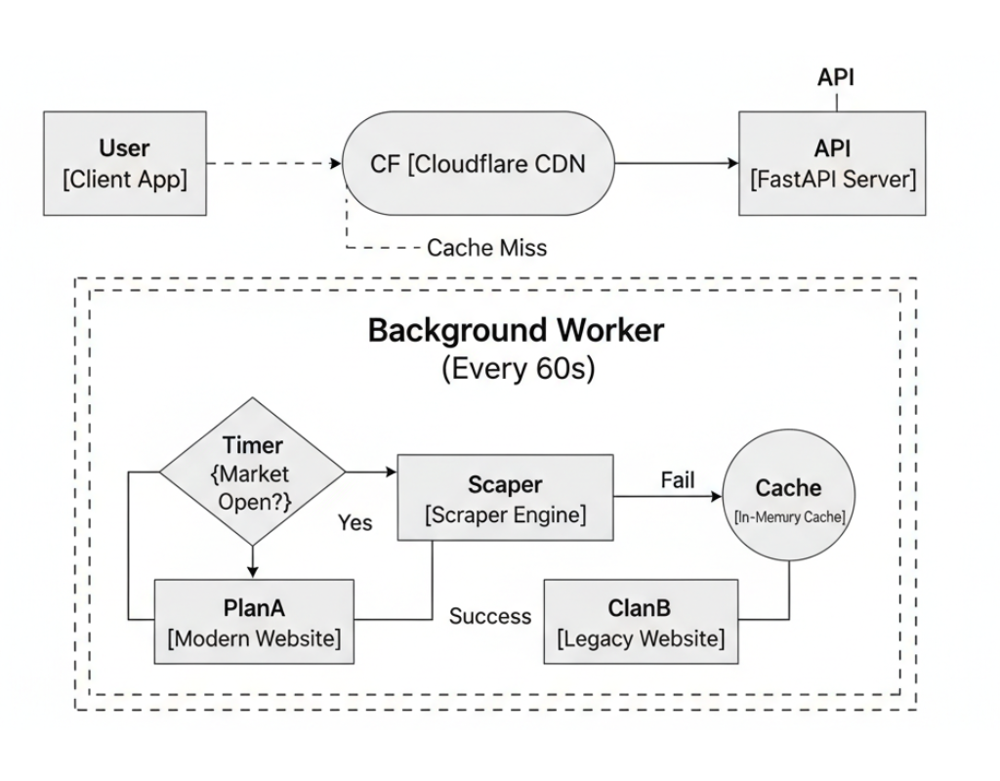

# 🏅 Thai Gold Price API

> **Hybrid Auto‑Switch Scraper for an Unstable Official Source**
> Built to survive real‑world website changes from the Thai Gold Traders Association.


---

## 🚀 Why This Project Exists

The official Thai Gold Traders Association website (`goldtraders.or.th`) is **not stable**.

It frequently switches between:

1. **Modern UI** — clean routes, dynamic layouts
2. **Legacy UI** — classic `.aspx` pages with GridViews

Most scrapers **break immediately** when the structure changes.

👉 **This API does not.**
It automatically detects which version is active and switches scraping logic in real time — **no manual intervention required**.

---

## ✨ Key Features

* 🔄 **Hybrid Auto‑Switching**
  Tries the modern site first → falls back to legacy logic if redirected or blocked

* ⚡ **Zero‑Latency Responses**
  Background worker refreshes data every **60 seconds**
  API serves directly from **RAM (in‑memory cache)**

* 🕒 **Market‑Aware Scheduler**
  Runs only during Thai market hours
  **Mon–Sat, 09:00–17:30 (UTC+7)**
  Sleeps on Sundays and off‑hours

* 🛡️ **Cloudflare‑Friendly**
  Proper `Cache-Control (s-maxage)` headers
  Designed to scale beyond **100k concurrent users**

* 🐳 **Docker Native**
  One‑command deploy on Railway, Render, or any VPS

---

## 🏗️ Architecture Overview

<p align="center">
  
</p>

**Design principle:**

> *Fetch once. Cache aggressively. Serve many.*

---

## 🔌 API Endpoints

| Method | Endpoint               | Description                                |
| ------ | ---------------------- | ------------------------------------------ |
| GET    | `/`                    | System status, active source, last update  |
| GET    | `/api/latest`          | **Most used** — latest gold price snapshot |
| GET    | `/api/gold`            | Simplified buy/sell prices only            |
| GET    | `/api/history`         | Full price history (current day)           |
| GET    | `/api/percent_jewelry` | Jewelry prices by purity (96.5%, etc.)     |

---

## 📦 Installation & Running

### Option 1: Docker (Recommended)

Playwright requires specific browser dependencies. Docker handles this cleanly.

```bash
# Build image
docker build -t gold-api .

# Run container
docker run -d -p 8000:8000 --name gold-api gold-api
```

---

### Option 2: Local Development

**Requirements:** Python 3.10+

```bash
# Install dependencies
pip install -r requirements.txt

# Install Playwright browser
playwright install chromium

# Run server
uvicorn main:app --reload
```

---

## ☁️ Deployment (Railway)

1. Push repository to GitHub
2. Create a new project on **Railway**
3. Select your repository
4. Railway auto‑detects the `Dockerfile` and builds everything

✅ Your API is live.

---

## 📝 License

This project is open‑source and released under the **MIT License**.

---

<p align="center">Made with ❤️ for Thai Developers</p>

